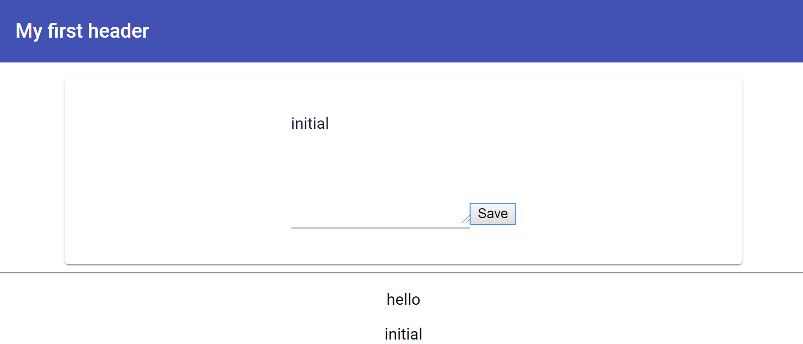

# Angular Frontend


* <a href="#1">Listening to Events</a>
* <a href="#2">Outputting Content</a>
* <a href="#3">Getting User Input</a>
* <a href="#4">Angular Material</a>
* <a href="#5">Adding a Toolbar</a>

**app.component.ts**

```{typescript}
import { Component } from '@angular/core';

@Component({
  selector: 'app-root',
  templateUrl: './app.component.html',
  styleUrls: ['./app.component.css']
})
export class AppComponent {
  title = 'mean-course';
}
```

Angular injects these script files into the ``index.html``

```{html}
<!doctype html>
<html lang="en">
<head>
  <meta charset="utf-8">
  <title>MeanCourse</title>
  <base href="/">

  <meta name="viewport" content="width=device-width, initial-scale=1">
  <link rel="icon" type="image/x-icon" href="favicon.ico">
</head>
<body>
  <app-root></app-root>
</body>
</html>
```


**app.moudle.ts**

```{typescript}

@NgModule({
  declarations: [
    AppComponent
  ],
  imports: [
    BrowserModule,
    AppRoutingModule
  ],
  providers: [],
  bootstrap: [AppComponent]
})
export class AppModule { }

```

declare app component

booststrap[AppComponent] tells angular search the index.html


**main.ts** is executed first

```{typescript}
if (environment.production) {
  enableProdMode();
}

platformBrowserDynamic().bootstrapModule(AppModule)
  .catch(err => console.error(err));

```


## <a name="1">Listening to Events</a>

**Event binding** it is an angular feature which allows us to listen to events in a declarative way.

```{html}
<button (click)="onAddPost()">
    Save
</button>
```


## <a name="2">Outputting Content</a>

a variable in the class  a property

**String Interpolation** 

英 [ɪnˌtɜːpə'leɪʃn] 　 　 美 [ɪnˌtɜːpə'leɪʃn] 　 　

- **n.** **插话；添加内容；<数>插值**

```{typescript}
export class PostCreateComponent {
  newPost = 'NO CONTENT';
  onAddPost(){
    this.newPost = 'this post';
  }
}
```

```{html}
<button (click)="onAddPost()">Save</button>
<p>{{newPost}}</p>
```

target the value property of the underlying ts object

**Property binding**

```{html}
<textarea rows="6" [value]="'post'"></textarea>
<textarea rows="6" [value]="newPost"></textarea>
```


## <a name="3">Getting User Input</a>

there are two ways of doing that

**local reference** add a hashtag #userInput

```{html}
<textarea rows="6" [value]="'post'" #userInput></textarea>
```


```{typescript}
export class PostCreateComponent {
  newPost = 'NO CONTENT';
  onAddPost(postInput:HTMLTextAreaElement){
    console.log(postInput);
    console.dir(postInput);
    this.newPost = postInput.value;
  }
}
```


**two-way binding**

import { FormsModule } from '@angular/forms';

```{typescript}
export class PostCreateComponent {
  enterText = 'initial';
  onAddPost(){
    this.newPost = this.enterText;
  }
}
```


```{html}
<textarea rows="6" [(ngModel)]="enterText"></textarea>
```


## <a name="4">Angular Material</a>

```{html}
<mat-card>
  <mat-form-field>
    <textarea matInput rows="6" [(ngModel)]="enterText"></textarea>
  </mat-form-field>
  <button
  mat-raised-button
  color = "accent"
  (click)="onAddPost()">Save</button>
</mat-card>

<hr>

<p>hello</p>
<p>{{newPost}}</p>


```


## <a name="5">Adding a Toolbar</a>

```{typescript}
import { MatInputModule, MatCardModule, MatFormFieldModule, MatToolbarModule } from '@angular/material';
```


```{html}
<mat-toolbar color="primary">My first header</mat-toolbar>
```



